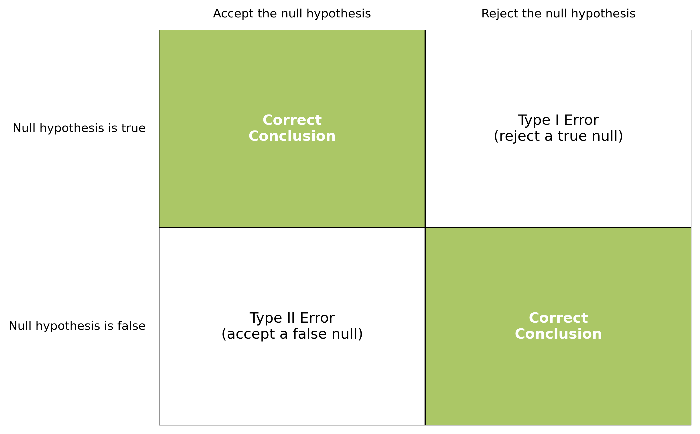
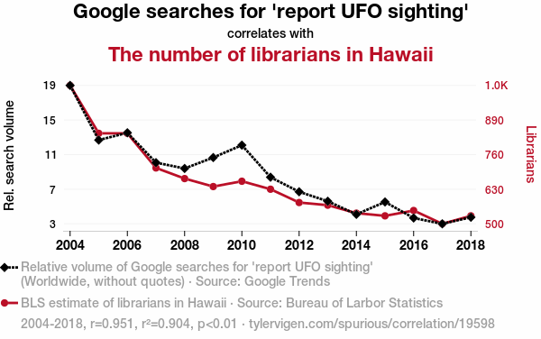
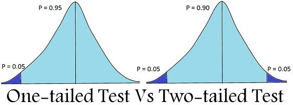

# Last week

## Overview of lecture 2

Continued concepts from data analysis, in particular probability distributions. 

- Representative data 
- Normal distribution
- Binomial distribution 
- Poisson distribution 
- Exponentials 
- Logarithms 

## What is the likelihood of events occuring? 

**Question**

::: {.fragment .highlight-red}
What is the probability of someone at UCL being over 6ft?
:::

**How can we try to answer this?**

Try to understand the distribution of heights. 

::: {.notes}
Last week we asked this question and we thought about the distribution of the data. 

This week we look at how to pose and address the research question. 
:::

# This week 

## Hypothesising 

Research science is about coming up with hypotheses and evaluating them.

::: {.notes}
This lecture thinking about posing and answering reserach questions. 

I have this great idea - considering the data is this idea plausibly true?
:::

## Learning Objectives
By the end of this lecture you should be able to:

::: {.incremental}
1. Establish a hypothesis for a given research project. 
2. Define the Type I and Type II errors. 
3. Calculate the p-value.
:::

# Motivations

## How do we know what to believe?

  

  

  

  <strong>Is cycling in London less safe since the introduction of Lime bikes?</strong>

# How do you come up with a hypothesis? 

## Flip a coin

:::: {.columns}

::: {.column width="50%"}

::: {.incremental}
- You have a coin. 
- You think it's a fair coin. 
- You toss it 10 times. 
- It comes up heads 7 times. 
:::

:::

::::

## What question can you ask?

:::: {.columns}

::: {.column width="50%"}

- You have a coin. 
- You think it's a fair coin. 
- You toss it 10 times. 
- It comes up heads 7 times. 

:::

::: {.column width="50%"}

::: {.fragment .strike}
Is it a fair coin? 
:::

::: {.fragment .strike}
What’s the probability that it’s fair?
:::

::: {.fragment .strike}
If the coin is fair, how likely would it be to see 7 heads out of 10 flips?
:::

:::

::::

## What question should you ask?

:::: {.columns}

::: {.column width="50%"}

- You have a coin. 
- You think it's a fair coin. 
- You toss it 10 times. 
- It comes up heads 7 times. 

:::

::: {.column width="50%"}

**Correct formulation:** 

If the coin is fair, how likely would it be to see 7 heads out of 10 flips *OR AN EVEN MORE EXTREME RESULT?*

:::

::::

# Establishing a Hypothesis 

## Step 1
**Define the null and alternative hypothesis**

. . .

[**H0** - the null hypothesis]{style="color:#49a0c4"} 

- this is the "status quo"

. . .

[**H1** - the alternative hypothesis ]{style="color:#49a0c4"} 

- my hypothesis
- needs some evidence to verify

## Step 2
**Set your significance level 𝜶**

[*The significance level is the threshold below which you reject the null hypothesis.*]{style="color:#49a0c4"} 

::: {.incremental}
- Decide what “too unlikely” means **before you do the test**.
- Common choice is 5% significance
  - 𝜶 = 0.05 
  - This means that if we see evidence that would have less than a 5% chance of occurring if the null hypothesis is true, then we reject the null hypothesis. 
:::

## Step 3
**Identify the evidence**

::: {.incremental}
- This could mean collecting the data
- Or identifying a suitable dataset
:::

## Step 4
**Calculate the p-value**

[*The p-value is the probability of seeing the evidence, or something even more extreme, if the null hypothesis is true.*]{style="color:#49a0c4"}

::: {.incremental}
- Calculated according to the appropriate statistical test
- The choice of test is determined by the research question and the data
:::

::: {.notes}
We'll come back to different types of statistical test later in the lecture
:::

## Step 5 
**Compare p-value with the significance level**

::: {.incremental}
- p-value > 𝜶 - Evidence not that unlikely. 
  - Not enough evidence to reject H0.
- p-value ⩽ 𝜶 - Evidence very unlikely. 
  - Reject H0 and accept H1.
:::

## The steps

::: {.incremental}
1. Define the null and alternative hypothesis
2. Set you significance level
3. Identify the evidence
4. Calculate the p-value
5. Compare p-value with hypothesis level
:::

# Types of error 

## Type I error
[*The true null hypothesis is incorrectly rejected.*]{style="color:#49a0c4"} 

This is caused by a **false positive**. The null hypothesis is true, but you get a false positive leading to you rejecting the null hypothesis. 

## Type II error
[*The false null hypothesis is incorrectly accepted.*]{style="color:#49a0c4"} 

This is caused by a **false negative**. The null hypothesis is false, but you get a false negative result, leading you to accepting the null hypothesis. 

## Example 

## Matrix of errors 

  

# A good hypothesis or a bad hypothesis? 
What makes a hypothesis good? 

## Understanding the literature and the context 
The hypothesis should not come out of thin air. 

## Asking ethical hypothesis questions 
It's important to not make unethical assumptions in choosing the hypothesis. 

Example: correlation between ethnicity and crime
- Use contextual knowledge to consider correlation vs causation 

## Correlation vs. Causation 
[**Correlation:** *Two variables are linearly related, as one changes so does the other.*]{style="color:#49a0c4"}

[**Causation:** *One variable influences the other variable to occur.*]{style="color:#49a0c4"}

Lots of things can be correlated - but it doesn't mean one event caused another. 

## Aliens and librarians

  
  

    Image credit: [Spurious Correlations](https://www.tylervigen.com/spurious/correlation/19598_google-searches-for-report-ufo-sighting_correlates-with_the-number-of-librarians-in-hawaii)
  

## Correlation IS NOT causation 
You might not know whether events are correlated, or causing each other. 

The point of the hypothesis test is to test your idea – but use your contextual understanding to come up with plausible (and ethical) initial questions

## The point of the scientific method
The process of coming up with a question, testing, iterating.

# Example: cyclists in London 

## Example - step 1
**Define the null and alternative hypothesis**

H0: Probability of injury has not changed. 

H1: Probability of injury has changed. 

## Example - step 2
**Set your significance level**

𝜶 = 0.05 

## Example - step 3
**Identify the evidence**

Dataset: 

## Example - step 4
**Calculate the p-value**

Aha!

# Statistical tests 

## Parametric vs. Non-parametric tests

## Parametric Tests 
- Evaluate hypothesis for specific parameters 
- Typically have assumptions about the distribution - e.g. assumed normal distribution 

## Non-parametric Tests 
- Evaluate hypotheis for entire population distirbution 
- Typcially less assumptions on the ditribution 

## How many tails 

Tests can be one-tailed or two-tailed. 

{.absolute top="170" left="30" width="700"}

# Parametric tests 

## T-test 
Assumes the data is normally distributed. 

## T-test example 

What is the probability of someone age 15 being a student on CASA007? 

The probability is very small so we reject. 

## Regression T-tests

Is the gradient non-zero?

This indicates a correlation between the two variables. 

...

This will be covered further in lecture X on linear regression. 

## Mean comparison t-test 

Compares the mean of two distributions. 

# Non-parametric tests 

## Kolmogorov-Smirnov test 
::: {.incremental}
- Compares two probability distributions 
- Can be used to test whether an observed sample came from a given distribution 
- Or to test whether two samples both came from the same distribution
:::

## Example

## Kernel density estimate 
::: {.incremental}
- Used to generate a smooth PDF for a random variable dataset. 
- Think of it as getting a smooth function to describe a histogram of data. 
- There are no assumptions about the prior distribution
:::

## Example 

# Overview 
We've covered: 

- What makes a good hypothesis 
- How to formally state a hypothesis 
- Types of statistical tests 

# Practical 
The practical will focus on establishing and evaluating a research hypothesis. 

. . .

Have questions prepared!