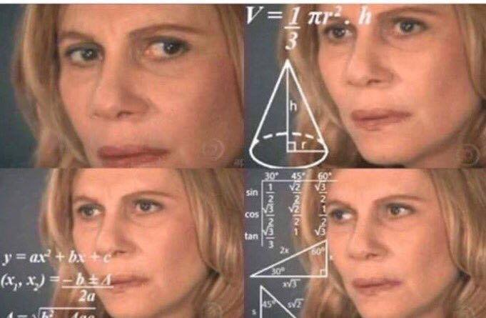
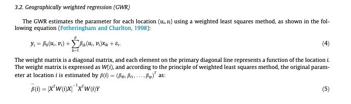

# Last week

## Overview of lecture 3

Looked at hypothesis testing:

- What makes a good hypothesis 
- How to formally state a hypothesis 
- Types of statistical tests 

# This week 

## Back to the maths

Maths underpins quantitative methods

::: {.incremental}
- Quantitative methods includes data analysis and machine learning 
- focused on algorithms and methodologies 
- **AND** practical examples of how these can be applied 
:::

## Key concepts 
:::: {.columns}

::: {.column width="50%"}

<div style="text-align:center;">
  
  <div style="font-size:0.8em; color: #555; margin-top:4px;">
    Image credit: [xkcd](https://xkcd.com/1838/)
  </div>
</div>

:::

::: {.column width="50%"}

- This lecture covers some of the key concepts. 
- The goal is to facilitate deeper understanding of the methods.

:::

::::


## Maths doesn't bite!

<div style="text-align:center;">
  
</div>

::: {.notes}
Maths can seem scary – but goal is to have a better understanding of key ideas.

Not expecting students to be experts!
:::

## Learning Objectives
By the end of this lecture you should:

1. Define concepts of linear maps, injections, bijections and surjections. 
2. Compute linear algebra equations using vectors and matrices.  
3. Describe how linear algebra relates to solving linear regression. 

# Motivation 

## What does it mean?

The goal is to understand equations like this: 

```{=tex}
\begin{align}
y = \sum_{i=1}^n \beta_i x_i
\end{align}
```

. . . 


or like: (need another example here)

```{=tex}
\begin{align}
y = \sum_{i=1}^n \beta_i x_i
\end{align}
```

::: {.notes}
This is a linear equation. 
:::

## But what does it mean???

Equations are often used in the methods sections of papers to describe the model. 

<div style="text-align:center;">
  
    <div style="font-size:0.8em; color: #555; margin-top:4px;">
    Taken from: Chiou, Jou, & Yang, (2015). Factors affecting public transportation usage rate: Geographically weighted regression. Transportation Research Part A: Policy and Practice.
  </div>
</div>

::: {.notes}
This is an equation for a geographically weighted regression model.  
::: 

# Basics 

## Mathematical notation 
Going to be using some mathematical notation 

- as this is what’s used in papers!

. . .

Formal way of writing maths. 

::: {.notes}
Provides a universal way of writing and understanding maths. 
:::

## Cheat sheet 

Mathematical notation cheat sheet: https://www.upyesp.org/posts/makrdown-vscode-math-notation/

<div style="text-align:center;">
  
</div>


## Mathematical models 

::: {.incremental}
- Mathematical models help us to understand the data
- In a regression setting the model describes a function that maps input to real-valued outputs 
- We can use mathematical models to validate our hypotheses/research questions 
  - How does the number of bedrooms affect house price? 
  - The relationship between time spent studying and students grades? 
:::

::: {.notes}
Thinking back to hypotheses from last week - mathematical models help us to evaluate our research question.
:::

## Machine learning 
[*A model which improves after data is taken into account.*]{style="color:#49a0c4"} 

- A specific type of mathematical model 
- The learning part is about automatically finding patterns 

::: {.notes}
Lots of different definitions of machine learning - but this us a simple one. 

In later weeks of the course we will look at machine learning concepts. 
:::

# Functions 

## What is a function?
[*A function is a mathematical operation which maps an input value to an output value.*]{style="color:#49a0c4"} 

. . .

**Mathematical description of a function**

```{=tex}
\begin{align}
f(x) = y
\end{align}
```

. . .

Maps values from a domain $X$ to a range $Y$.

```{=tex}
\begin{align}
f(x) = y \text{ for } x \in X, y \in Y 
\end{align}
```

## Domain and range 
[***Domain** - the numbers mapped from*]{style="color:#49a0c4"} 

[***Range**: the numbers mapped to*]{style="color:#49a0c4"}  

. . .

In the applied sciences the domain and range are typically $\mathbb N$, $\mathbb Z$, $\mathbb R$

. . .

::: {.incremental}
- $\mathbb N$ 
  - **Natural numbers** 
  - 0,1,2,3,4,5,6…
- $\mathbb Z$ 
  - **Integers** 
  - … -4, -3, -2, -1, 0, 1, 2, 3, 4, … 
- $\mathbb R$ 
  - **Real numbers** 
:::

## Data represented algebraically 
[*Algebra is a way of expressing numbers in a generalised or abstract form.*]{style="color:#49a0c4"} 

Example: 

```{=tex}
\begin{align}
x \in \mathbb N 
\end{align}
```

. . .

- This is the data represented algebraically. 
- Typically a vector of numbers $X^n$

```{=tex}
\begin{align}
X^n = (x_1, x_2, x_3, ... , x_n)
\end{align}
```

## Example 1
Probability density function of normal distribution 

```{=tex}
\begin{align}
f(x) = \frac{1}{\sqrt{2 \pi \sigma^2}} e^{-\frac{(x-\mu)^2}{2\sigma^2}}
\end{align}
```

where $x \in \mathbb N$ and $f(x) \in [ 0 , 1 ]$. 

<br>
<br>

<div style="background-color:#2e6260; color:white; padding:8px; border-radius:5px; margin-top:10px;"> <em>Note</em> 

\n $[0, 1]$ is the set of real numbers between $0$ and $1$, inclusive of $0$ and $1$. </div>

::: {.notes}
Last lecture we were thinking about PDFs - these are a function. They map the input value, the 'x' to the output range which is a probability between 0 and 1. 
:::

## Example 2

The other function we've seen is a linear equation. 

```{=tex}
\begin{align}
f(x) = ax + b
\end{align}
```

# Linear equations 

## Linear equation
[*A linear equation is a linear combination of variables.*]{style="color:#49a0c4"}

Examples include:
```{=tex}
\begin{align}
f(x) = ax + b
\end{align}
```

. . .

Graphically this is a straight line. 

. . .

<div style="background-color:#2e6260; color:white; padding:8px; border-radius:5px; margin-top:10px;"> 
<em>"linea"</em> is the latin word for line or string. </div>

Add a plot of a linear line here.  

## Linear equation(s)

We can generalise to multiple equations. 

. . .

They are:

::: {.incremental}
- A system of multiple linear functions 
- Which can be represented by matrices 
- They can have 0, 1, or many solutions 
:::

## Example 1 

```{=tex}
\begin{align}
x+y=10
\end{align}
```

. . .

::: {.incremental}
- What could $x$ and $y$ be? 
- Could have $x=y=5$
- Or $x=2.5$ and $y=7.5$
:::

. . .

There are many solutions!!!

Many solutions = under-specified

::: {.notes}
Under-specified but simple to solve!
:::

## Example 2 

```{=tex}
\begin{align}
x+y=10
\\
2x+y=15
\end{align}
```
. . .

In school might have solved this using substitution. 

::: {.incremental}
- Rearrange the first equation to get $y=10-x$
- Substituting in we get $2x+(10-x)=15$
- $x+10=15$ $\implies$ $x=5$ $\implies$ $y=5$
:::

. . .

There is exactly one solution!

::: {.notes}
Perfectly specified and we can solve it without too much difficulty 
:::

## Example 3 

```{=tex}
\begin{align}
x_1+x_2+x_3+x_4=10
\\ x_1+4x_2+x_3+x_4=25
\\ x_1+4x_2+43x_3+x_4=37
\\ x_1+4x_2+7x_3+59x_4=1073
\end{align}
```

. . .

Very hard to solve!

::: {.notes}
An example (when things get more complicated)
:::

# Matrices 

## Matrix notation

```{=tex}
\begin{align}
x_1+x_2+x_3+x_4=10
\\ x_1+4x_2+x_3+x_4=25
\\ x_1+4x_2+43x_3+x_4=37
\\ x_1+4x_2+7x_3+59x_4=1073
\end{align}
```

. . .

Can be written as:

```{=tex}
\begin{align}
\begin{bmatrix}1&1&1&1\cr1&4&1&1\cr1&4&43&1\cr1&4&7&59\end{bmatrix}\begin{pmatrix}x_1\cr x_2\cr x_3\cr x_4\end{pmatrix} = \begin{pmatrix}10\cr 25\cr 37\cr 1073\end{pmatrix}
\end{align}
```

## Generalised matrix form 

The generalised matrix form (for a 4x4 matrix is):

```{=tex}
\begin{align}
\begin{bmatrix}a_{1,1} & a_{1,2} & a_{1,3} & a_{1,4}\cr a_{2,1} & a_{2,2} & a_{2,3} & a_{2,4}\cr a_{3,1} & a_{3,2} & a_{3,3} & a_{3,4}\cr a_{4,1} & a_{4,2} & a_{4,3} & a_{4,4}\end{bmatrix}\begin{pmatrix}x_1\cr x_2\cr x_3\cr x_4\end{pmatrix} = \begin{pmatrix}y_1 \cr y_2 \cr y_3 \cr y_4\end{pmatrix}
\end{align}
```

## Along the corridor, down the stairs 

Matrices are indexed by row ($m$) and by column ($n$). 

## Example 

$m=2$, $n=2$ matrix: 

```{=tex}
\begin{align}
\begin{bmatrix}1&1\cr1&4\end{bmatrix}
\end{align}
```

. . .

$m=3$, $n=2$ matrix: 

```{=tex}
\begin{align}
\begin{bmatrix}1&1&2\cr1&4&7\end{bmatrix}
\end{align}
```

. . .

<div style="background-color:#2e6260; color:white; padding:8px; border-radius:5px; margin-top:10px;"> <em>Note</em> 

\n When $m=n$ we have a square matrix. </div>

## Matrix addition 

```{=tex}
\begin{align}
\begin{bmatrix}1&1\cr1&4\end{bmatrix} + \begin{bmatrix}1&0\cr2&6\end{bmatrix} = \begin{bmatrix}2&1\cr3&10\end{bmatrix}
\end{align}
```

We denote matrices by capital letters: $A$, $B$, ... :


## Matrix multiplication 

## Identity matrix 

## Inverse matrix 

# Solving systems of equations 

## Writing in matrix form 

## Simplifying 


# Overview 

## Covered
We've covered: 

- Mathematical notation
- Functions 
- Sums and Products
- Matrices 
- Algebraic representations 

## Key takeaways 


# Practical 
The practical will focus on understanding mathematical equations.  

. . .

- Have questions prepared!